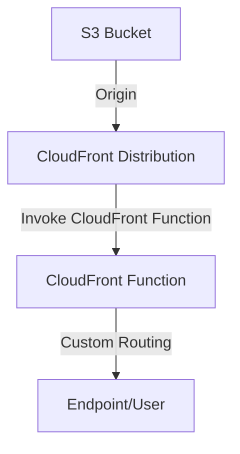

# Portfolio website
Yeah so this is it, nothing too fancy except

## Hosting

```mermaid
graph TD;
    S3Bucket["S3 Bucket"] --> |"Origin"| CloudFront["CloudFront Distribution"];
    CloudFront --> |"Invoke CloudFront Function"| CFFunction["CloudFront Function"];
    CFFunction --> |"Custom Routing"| Routing["Endpoint/User"];
```