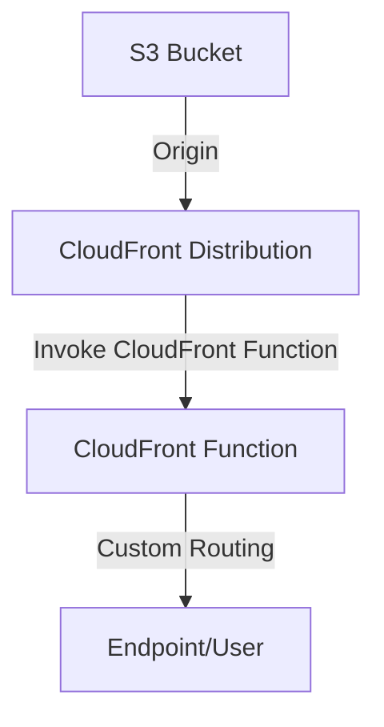

# Portfolio website
Yeah so this is it, nothing too fancy except

## Hosting
The website is created using Astro as a static site as such it can be hosted on S3 with CloudFront as CDN
This in turn creates a near instant loading times due to content 

Thanks to this & the fact that everything is attached to Route53, the overall hosting of the website is almost nothing except the costs of Hosted Zone.
